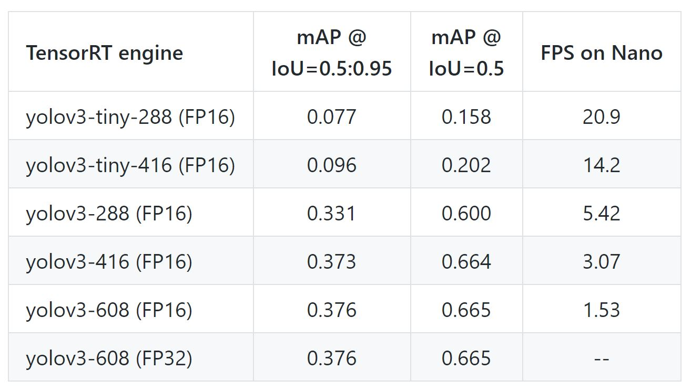

# Yolov3_TRT
Pytorch YOLOV3 to TensorRT for inferencing on Jetson Nano

## Requirements   
* numpy   
* onnx==1.4.1   
* pycuda==2019.1   
* wget>=3.2   
* Pillow>=5.2.0   
* bistiming   
* scipy==1.2.1   

## Jetson Nano Setup
**1. Jetson Nano Installation:**   
Follow NVIDIA instruction from [NVIDIA Site](https://developer.nvidia.com/embedded/learn/get-started-jetson-nano-devkit)
   
**2. Edit Swap file:**   
```
fallocate -l 4G /swapfile
chmod 600 /swapfile   
mkswap /swapfile 
swapon /swapfile   
swapon -show
sudo ./set_swap.sh
```
**3. Clone yolov3-tensorrt sample from this [repo](https://github.com/penolove/yolov3-tensorrt), download yolov3.weights file:**
```
git clone https://github.com/penolove/yolov3-tensorrt   
cd yolov3-tensorrt
mkdir weights
cd weights 
wget https://pjreddie.com/media/files/yolov3.weights   
cd ..
```   
   
**4. Convert yolov3 to ONNX:**
```
python3 yolov3_to_onnx.py
```   
   
**5. Convert ONNX to tensorRT:**
```
python3 onnx_to_tensorrt.py
```

**6. FP16 MODE: To run model on FP16 mode (on Tensor Core), ONNX weights need to be converted to FP16 mode in [5.]. To do this, *onnx_to_tensorrt.py* needs to be modified as follow:**

```
with trt.Builder(TRT_LOGGER) as builder, builder.create_network() as network, trt.OnnxParser(network, TRT_LOGGER) as parser:
    builder.max_workspace_size = 1 << 30 # 1GB
    builder.max_batch_size = 1
    builder.fp16_mode = True
```  
## Result:
1. Completing "1." to "5." will give you a 1FPS engine running on Jetson Nano.   
2. After "6." will give you a 2FPS yolov3-608 engine running on Jetson Nano.   

## Todo:
- [x] Be able to run pytorch yolov3 model on Jetson Nano.
- [x] Convert model to TensortRT Engine for system optimization.
- [x] Be able to run FP16 mode for 2x faster speed.
- [ ] Use [ONNX-simplifier](https://github.com/daquexian/onnx-simplifier) for light ONNX graph before converting it into tensorRT version.
- [ ] Try out lower input resolution for speed test (288x288) to compare with SSD300 MobileNet.
- [ ] Do speed and accuracy test on yolov3-288 version.
- [ ] Train yolov3 on 1-class for product-specific model, thus increase speed.

## Refference:
1. https://jkjung-avt.github.io/tensorrt-yolov3/   
As showed in [jkjung-avt/tensorrt_demos](https://github.com/jkjung-avt/tensorrt_demos) git repo, he test yolov3 on Jetson Nano and get 20FPS for yolov3-tiny-288 (FP16) and 5FPS for yolov3-288 (FP16).   



